# PasswordManager 
  This project is able to let users save the login credentials into the Firebase database. All the function is working already, the only thing you need to do is create your database and connect to the database. That's all!!

  This project is using Angular to build. Please make sure you have install `Angular CLI`
  
  **Table of Contents**
  - [How to run this project?](#how-to-run-this-project)


##How to run this project?
1. First, you need to install `Angular CLI` if you haven't install yet please refer [Here](https://angular.io/guide/setup-local)
2. Once the `Angular CLI` is ready on your machine, clone this project.
  ```
    git clone https://github.com/zhentong98/PasswordManager
  ```
3. Open your `terminal / Command Prompt` cd to that folder you clone just now.
4. Install all the packages we need for this project.
```
  npm install
```
5. Set up the firebase. [Firebase](https://firebase.google.com/?gclid=CjwKCAjw3MSHBhB3EiwAxcaEu2sJ8bL7s9x9kT2PX8i-bE0dSHpBHU4LQeVED3woyi5i4QdpoTxaWxoCHVEQAvD_BwE&gclsrc=aw.ds) <br>
  Click on the `Get Started`
   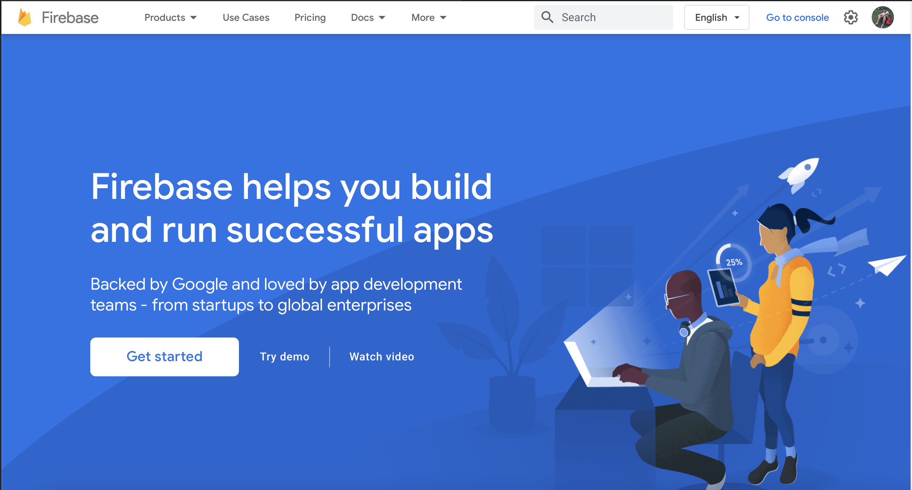
   
6. Click on the `Add Project`
  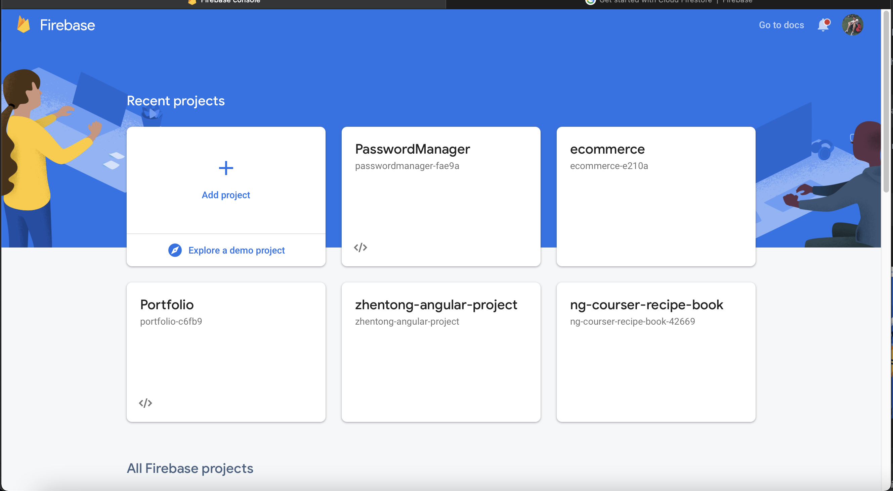
   
7. Enter your `Project Name` and click `Continue`
  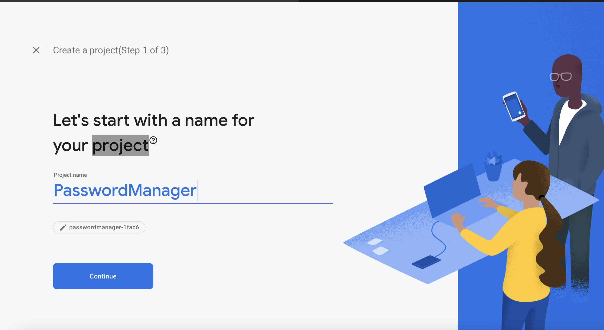
   
7. click the `Continue` again.
  
   
8. Here we select the `Default` one and click the `Create Project`.
  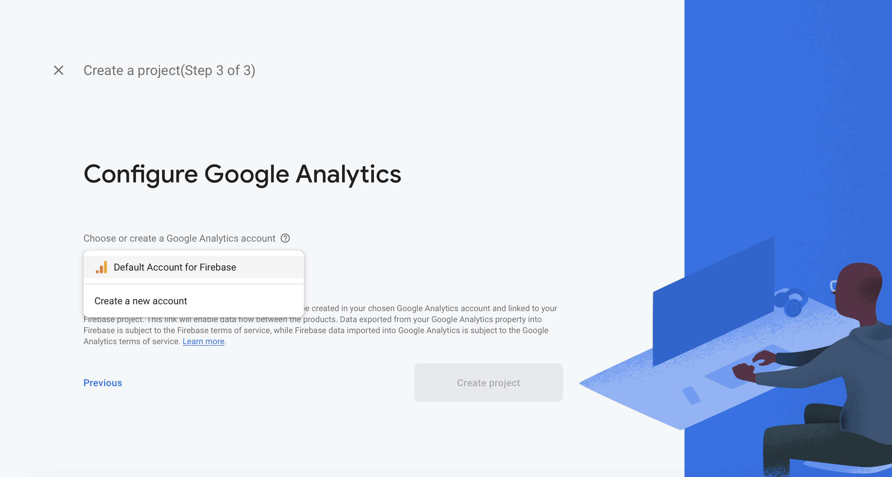
   
9.Once the project created, then click the `Continue`.
  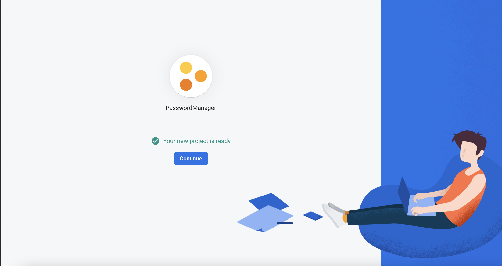

10.Now the project already created, lets continue to enable the `Authentication`
  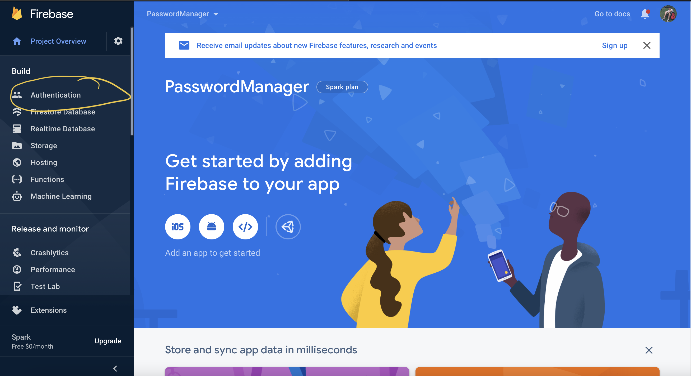

11.Click on the `Get Started` button.
  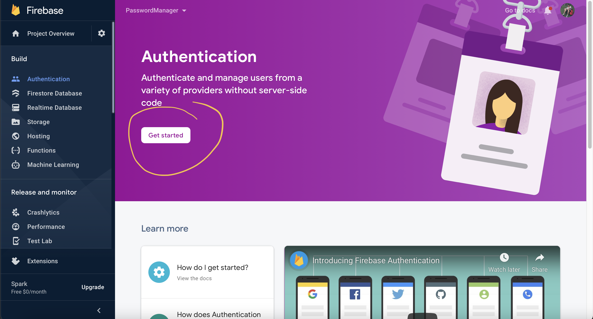

12.Click on the `Edit icon`.
  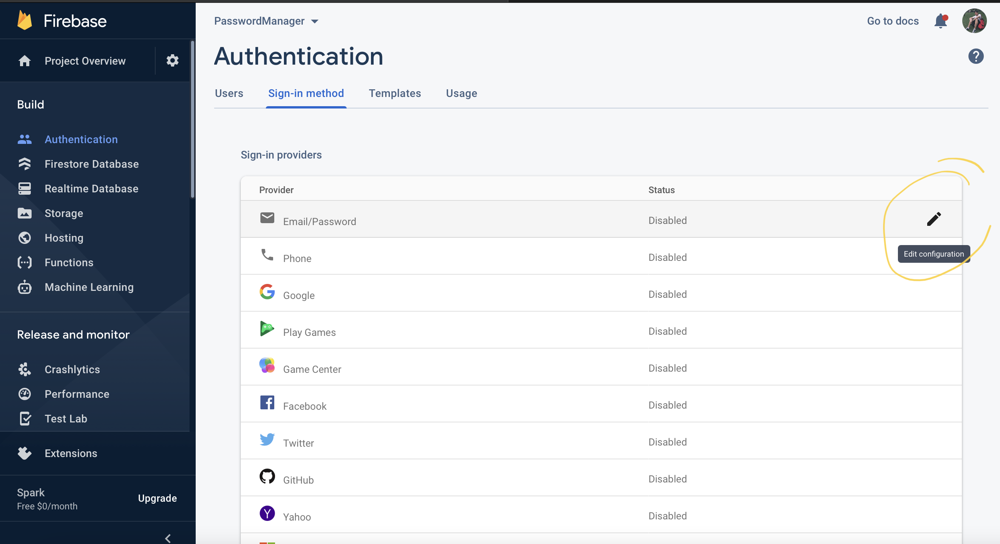

13. Enable this and click `Save`.
  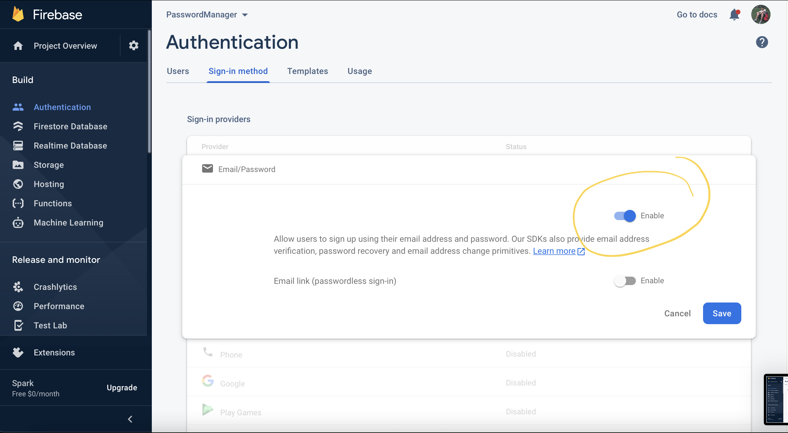
    
14. Okay's `Authentication` is enabled, let's move forward to the Firestore Database.
  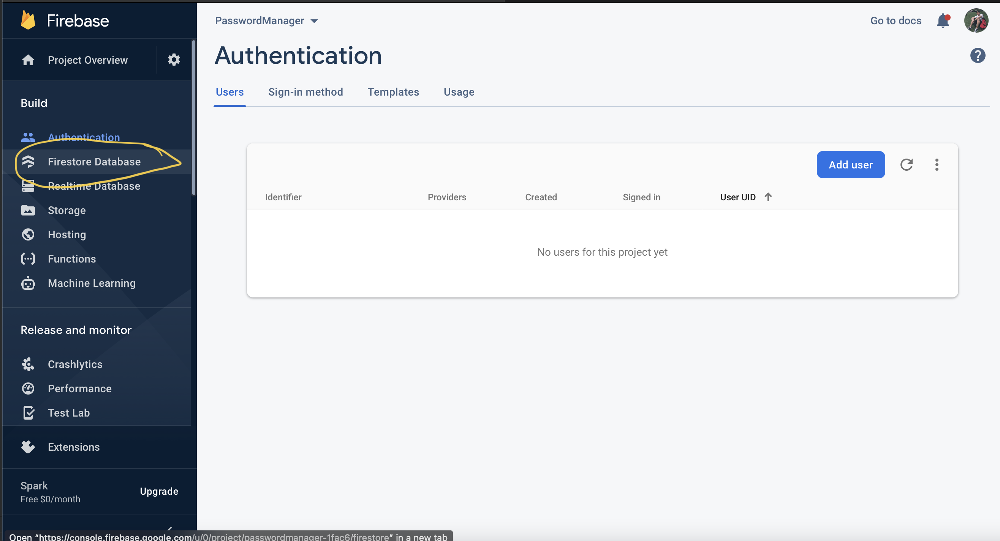
    
15. Click on the `Create Database` button.
  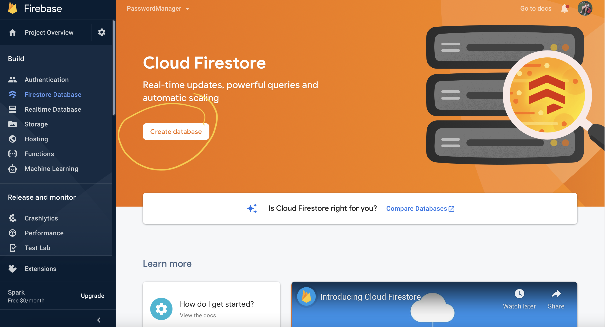
    
16. For now, we select the `test mode` first. We can change it later and click on the Next button.
  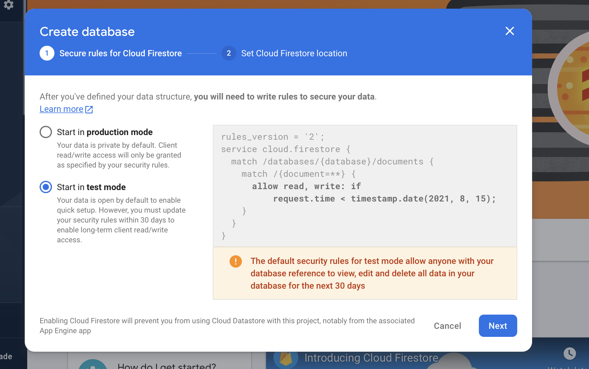
    
17. Select the firestore location, I select the `asia-northeast2` and click on the `Enable` button.
  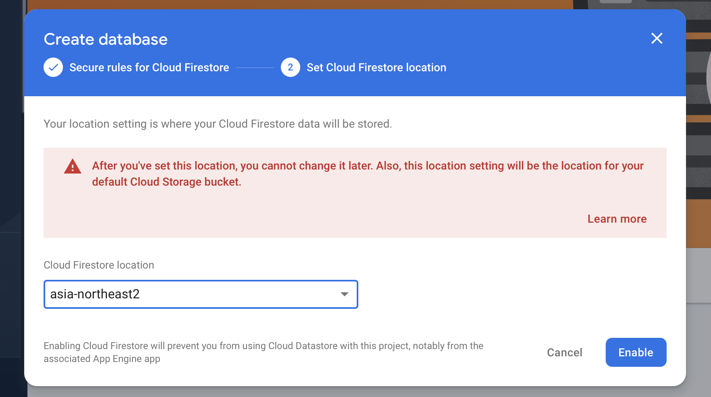
    
18. Once the database created, should like this.
  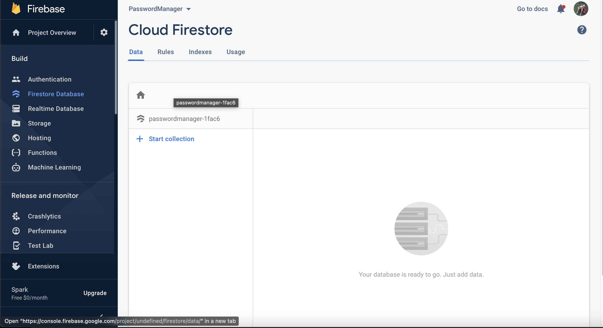
    
19. Nice!! `Firestore Database` we have also done. Let's move to the last step, configure the firebase connection for our Project.
  Click on the `settings` icon and select `Project settings`.
    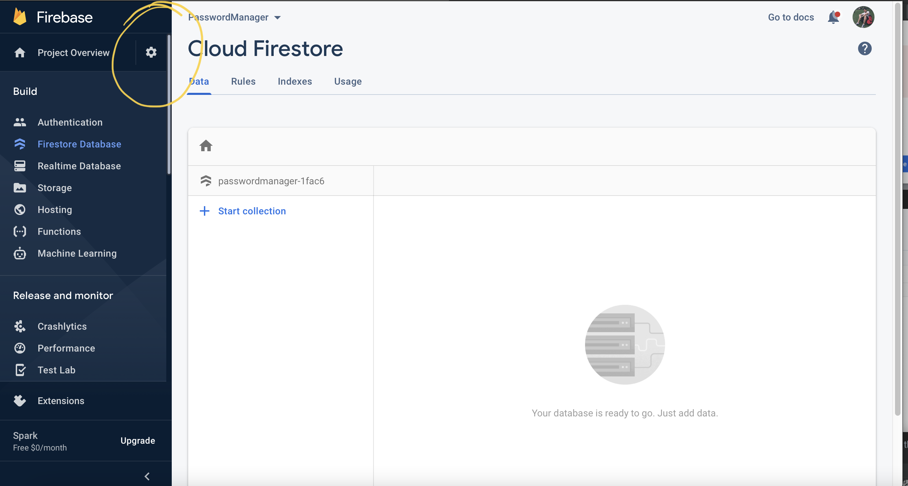
    
20. Scroll down click on this button.
  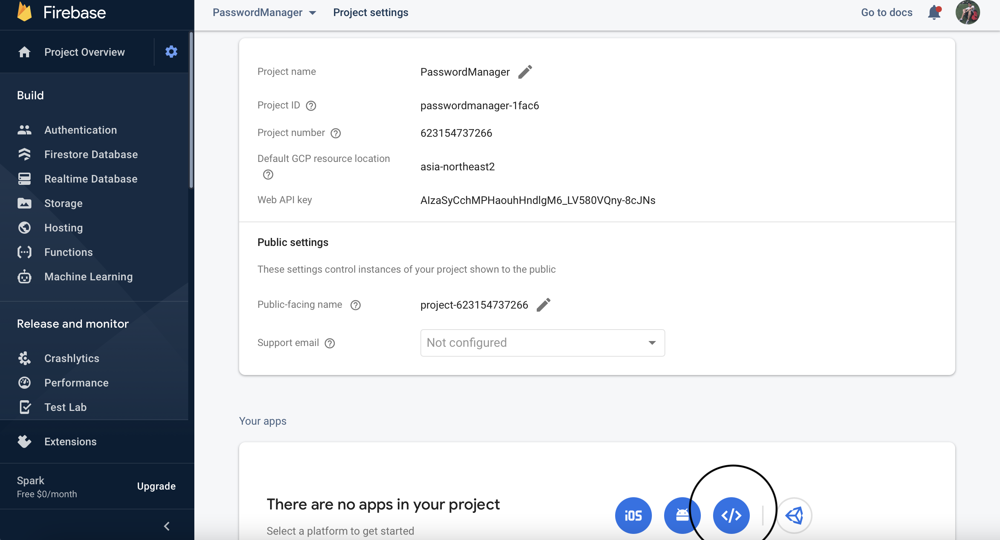
    
21. Enter your project name and click `Register App`
  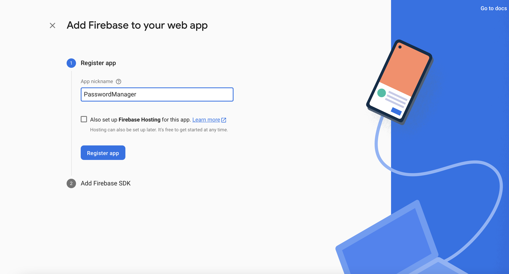
    
22. Copy this information and paste into the [enviroment.ts](src/environments/environment.ts) and [enviroment.prod.ts](src/environments/environment.prod.ts).
  
    `enviroment.ts` <br>
    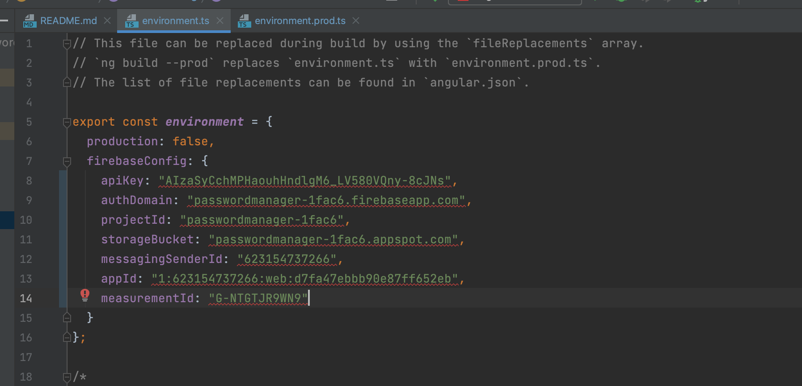
    `enviroment.prod.ts` <br>
    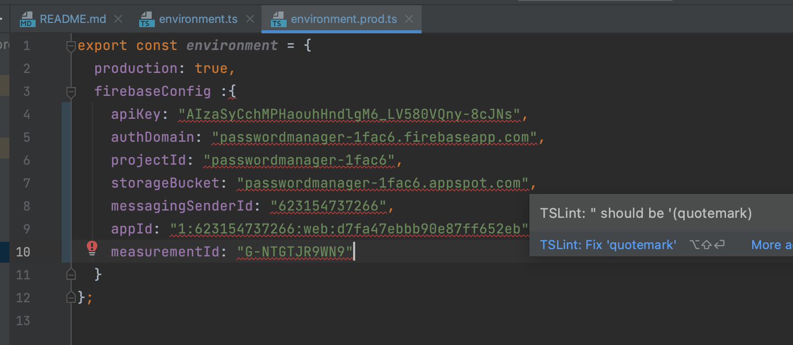
    
23. That's all you need to configure for this project! now you should able to run this project on your machine, cd to the folder where you clone this project, and run this command on your `Terminal / Command Prompt`
  ```
    ng serve
  ```
The default url should be this.
```
  http://localhost:4200
```
  
    
  

